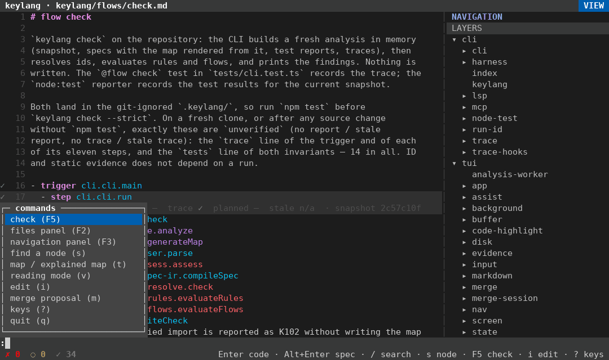
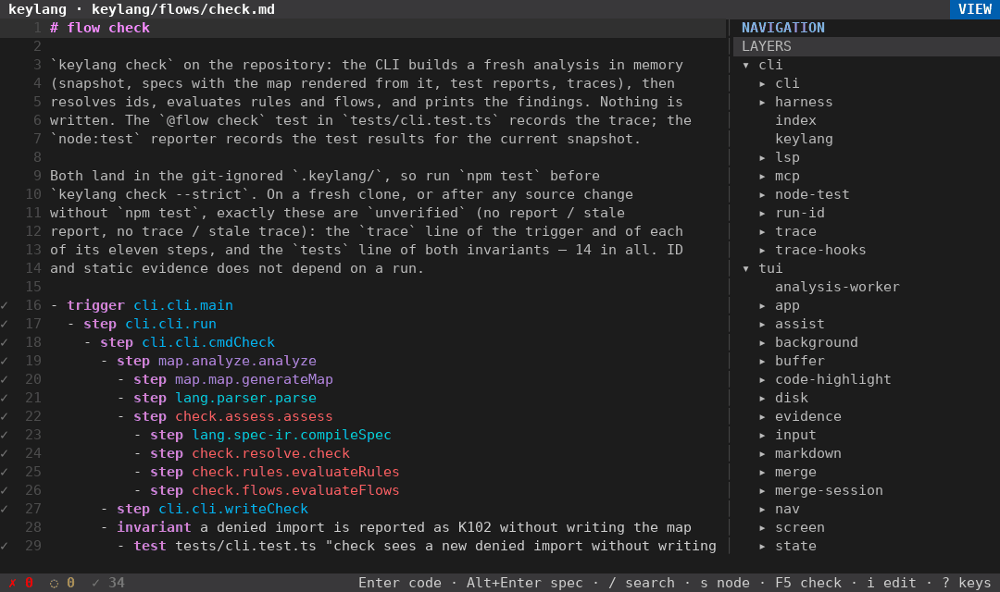
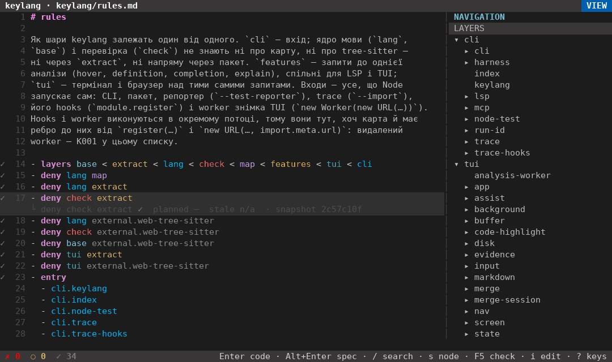
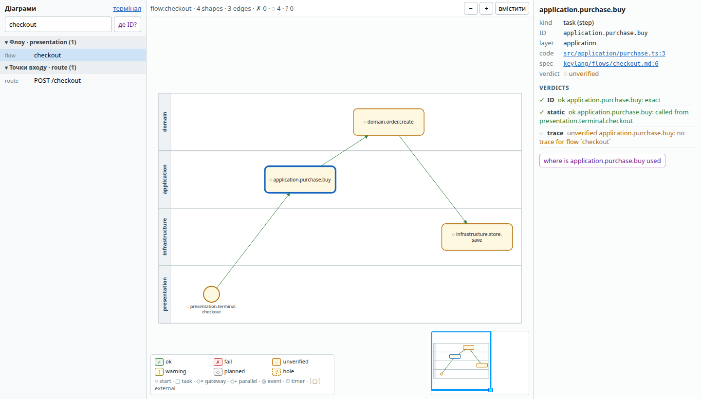
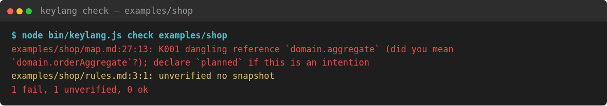
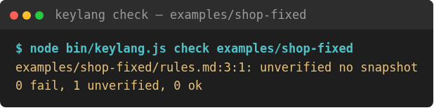
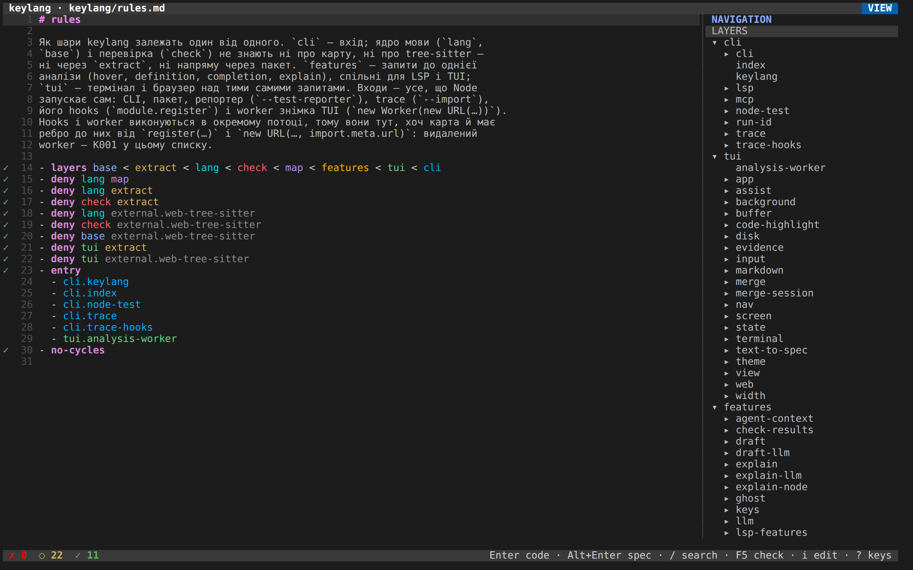
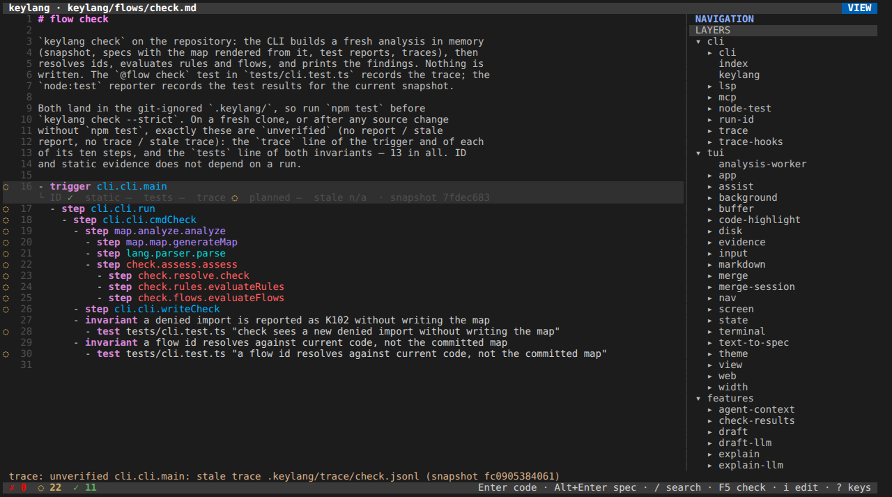
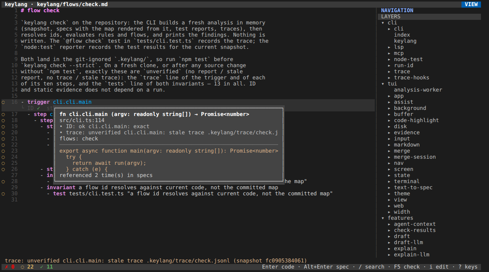

# keylang

**English** · [Українською](README.uk.md)


keylang is Markdown that lives next to your code. In it you write the spec: which parts of the program may know about which, and which scenarios must keep working. You do not write the functions yourself — an agent generates the code from that spec. keylang does not run the agent either. Its job is to check that the generated code still matches what the spec says.

Take an online shop as an example. The screen starts a purchase, and the purchase asks the order rules to build an order. The order rules, in turn, know nothing about the screen or the database. That last sentence is a rule, and keylang can enforce it: when the code breaks it, the check can fail the build.

Here is the terminal UI. Type `:`, then `rules`, then press Enter, and the cursor walks down to the `deny` lines:



`/` searches for `cli.cli.main`. One line further down, `K` opens the function behind that step:



`?` lists all the keys, and Esc closes the list again:



These clips were recorded right after `npm test`. Because the trace from that run matches the code, nothing is left unverified, and the status line reads `✗ 0  ◌ 0  ✓ 34`.

If these words are new to you, start with the [pre-course](docs/course/pre/README.md) ([українською](docs/course/pre/uk/README.md)). The main guide is the [course](docs/course/README.md) ([українською](docs/course/uk/README.md)). If you want to add a feature to a repository that already exists, follow [that track](docs/course/existing/README.md) ([українською](docs/course/existing/uk/README.md)); if you are starting a Telegram bot, a Python CRUD or a NestJS app from nothing, follow [this one](docs/course/from-scratch/README.md) ([українською](docs/course/from-scratch/uk/README.md)).

For reference, the exact grammar is in [`docs/format.md`](docs/format.md) (in Ukrainian), and the commands are in [`docs/tools.md`](docs/tools.md). An agent can install keylang from [`llm.txt`](llm.txt) ([raw](https://raw.githubusercontent.com/Ivlad003/keylang/master/llm.txt)), which also tells it when to use keylang and when not to. Where the project is heading, including work that is not built yet, is described in [`docs/design.md`](docs/design.md).

You need Node.js ≥ 22.18. Inside a clone of this repository, `node bin/keylang.js` runs the TypeScript sources directly, without a build step. The published package, by contrast, is plain JavaScript: before publishing, `prepack` compiles `src/` into `dist/`. Either way, nothing native gets compiled on your machine during install.

## What you write

| File | Who writes it | What it is |
|---|---|---|
| `keylang/map/*.md` | `keylang map` | Layers, modules and functions, with links to source lines. Generated, so do not edit |
| `keylang/rules.md` | you | Who may depend on whom: `layers`, `allow`, `deny`, `entry`, `exports`, `no-cycles` |
| `keylang/flows/*.md` | you | One scenario per file. Each step reports `ID`, `static`, `tests` and `trace` separately |
| `keylang/features/*.md` | you | What to build next. `keylang feature <slug>` tells you when it is done |
| `.keylang/proposals/` | an agent | A draft change to the spec, which a person merges piece by piece |
| the program | an agent | The functions, generated from the spec. You do not write them, and keylang does not start the agent |

Specs refer to code by id. An id looks like `application.purchase.buy`, and it names the layer, the module and the function in that order. Because an id is not a line number, the spec stays valid after edits that merely move code up or down.

If `keylang.json` contains `"explain": {"map": true}`, `keylang map` also writes `keylang/map-explained/`. That version of the map adds one or two sentences under each node, taken either from the doc comment in the code or from a saved note that names the model which wrote it and the date.

## Three answers

Every check ends in one of three answers:

- `ok` — the claim held everywhere keylang looked.
- `fail` — keylang found and showed a concrete break. The exit code is 1.
- `unverified` — neither of the above: keylang hit a hole, a missing file or an outdated trace, so it could not decide. This is not a pass, and `--strict` turns it into exit code 1.

The exit codes are: `0` when nothing blocks, `1` for a violation (this includes a stale map under `map --check` and any `unverified` under `--strict`), and `2` for bad usage or a file error. To keep machine output clean, `parse --json` writes only JSON to stdout, while `check` writes its findings to stdout and the summary to stderr.

It is just as important to know what keylang does not do: it does not decide whether the program is correct, safe or finished. Its limits are these:

- A sentence written under a node is prose. keylang keeps it, but does not prove it.
- A call keylang cannot name statically (`obj[k]()`, an unknown decorator, `eval`) is a hole, so the answer for it stays `unverified`.
- For Rust and Python, keylang records imports and calls, but not type edges.
- For PHP, it records imports, calls and the types from type hints. A call through an interface, or a trait's method called through `$this`, is still a hole.
- Wiring generates a TypeScript `wire()` function, but it does not stop the rest of the program from importing whatever it wants. Catching that is still the job of the rules.
- keylang reads test reports and traces that already exist. It does not run the tests, typecheck the code or review security.
- Go, Java, Ruby and other languages are simply absent from the snapshot. That absence does not prove they depend on nothing.

## Try it

```sh
npx keylang init .      # guess layers, write keylang.json, build the map
npx keylang check       # ids and rules under keylang/
npm i -g keylang        # then just `keylang …`
npx keylang clone https://github.com/owner/repo   # someone else's repo: clone into the cache, map it
npx keylang web https://github.com/owner/repo     # the same, then the UI in a browser
```

From a clone of this repository:

```sh
npm install
node bin/keylang.js map                  # rewrite keylang/map/*.md and .keylang/index.json
node bin/keylang.js map --check          # CI: exit 1 when the map is stale
node bin/keylang.js check                # writes nothing
node bin/keylang.js check --strict       # unverified becomes a failure
node bin/keylang.js explain K001         # what a code means and how to fix it
node bin/keylang.js                      # terminal UI (? lists keys, q quits)
node bin/keylang.js web                  # the same UI in a browser; open the printed URL
```

`keylang web` also serves a diagram page (`/diagrams`, linked from the terminal page): flows, discovered flows and entry points in a searchable list, the chosen one drawn as a BPMN-like diagram with lanes per layer and verdict colours, and a side panel with the clicked step's ID, `file:line` (a `vscode://` link), verdicts and where else the ID is used. It is read-only and refreshes itself every few seconds ([docs/tui.md](docs/tui.md#сторінка-діаграм-diagrams)).



`examples/shop` keeps a wrong id, `domain.aggregate`, on purpose, so that you can see an error. The example also has no code snapshot, which means the flow cannot be proved either. The check exits with code 1:



`examples/shop-fixed` corrects the id. That folder still contains no TypeScript, so the rules stay `unverified` (`no snapshot`), but nothing fails and the check exits with 0:



The still pictures below show `node bin/keylang.js web` running on this repository on 2026-09-28. At that moment the local trace and the `node:test` report were older than the code snapshot, so the marks that depend on them are `unverified` — which is the honest result, not a bug. The numbers also differ between the two views, and for a reason: the status line counts lines (each line gets its worst mark), while `keylang check` counts every single piece of evidence. So the same run prints `0 fail, 22 unverified, 43 ok`, while the UI shows `✗ 0  ◌ 22  ✓ 11`. The clips at the top of this page come from a later run.

These are the rules of this repository itself. They say that the language core (`lang`, `base`) and the checker must not depend on the extractor or on tree-sitter:



This is the `check` flow. Its id resolves exactly, and there is no static parent call to prove; the trace file, however, comes from an older snapshot:



Pressing `K`, or hovering with the mouse, shows the function's signature, its file and the first few lines of the declaration:



You will find more pictures in [lesson 8 of the course](docs/course/08-use-cases.md).

## What it costs

The grammar is a small slice of Markdown, and a word means whatever its parent line allows it to mean. A full code fence inside a list item is not supported. When `keylang fmt` cannot trust a file's nesting, it refuses to reformat it, so that after `fmt` what GitHub renders and what `check` understands still agree.

When a module is renamed or moves to another layer, you have to update its ids by hand. Also keep in mind that the map shows only modules and dependencies: deployments, data shapes and the reasons behind a decision still belong in prose or in an ADR.

Finally, exit code 0 only means that nothing blocks. Without `--strict`, a run can still exit 0 while some answers are `unverified`.

## What kind of language

keylang is a structured list, not a programming language. It has no variables and no loops, so any file can be read from top to bottom without running anything. A bad line gets a diagnostic code (K001–K302), and parsing carries on past it; `keylang explain` tells you what each code means.

The language grew out of the Markdown form of Timur Shemsedinov's architecture language. How it compares with import-linter, ArchUnit, Structurizr and similar tools is discussed in [`docs/research-pl.md`](docs/archive/research-pl.md) (in Ukrainian).

## What is built

Below is the short list of milestones; the details are in [`docs/design.md`](docs/design.md) §9.

- **M0.** The format, the parser, ids that resolve across files, codes K001–K006 and `fmt`. The language core does not import tree-sitter.
- **M1.** The map and rules for TypeScript and JavaScript, with codes K101–K105. Running `keylang check` on this repository itself finds no violations.
- **M2–M3.** Flows with `ID`, `static`, `tests` and `trace` evidence, and `planned` nodes (K201, K202). The CLI, the LSP, MCP and the UI all share one analysis. A thin VS Code client lives in `editors/vscode/`; it is not published on the Marketplace and is not part of the npm package.
- **M4.** The terminal UI, and the same UI in a browser via `keylang web`.
- **M5.** Rust and Python on the same graph, with the limits listed above. Trace adapters live in `adapters/python` and `adapters/rust`, and `keylang trace-plan <flow>` prints what to instrument.
- **M6.** `# wiring` writes a typed `wire()` in `keylang.gen.ts` ([ADR 0003](docs/adr/0003-wiring-lifecycle.md)).
- **M7.** `draft`, `code-to-spec`, `spec-to-code` and `explain <id> --llm` write proposals rather than editing the spec directly. Likewise, `apply_diff` in `keylang mcp` only writes a proposal. Voice input is optional (`Ctrl+R`). `keylang doctor` reports problems and changes nothing.
- **M8.** `init` and `keylang agents` install a short block in `AGENTS.md`, the MCP server and a skill for Claude Code, Codex, Cursor or opencode ([ADR 0005](docs/adr/0005-harness-integration.md)). `keylang baseline` writes `keylang/rules.baseline.md`, which lists the layer dependencies the graph does not have yet. `check --changed` and `keylang hook stop` block an agent's turn only when a new violation appears. All of this is covered by the CLI and MCP tests, but it has not yet been tried end to end with Claude Code and Codex on an outside repository.
- **PHP.** Classes, functions, `use` and calls on the same graph ([ADR 0015](docs/adr/0015-php-imports-name-declarations.md)). Composer packages appear as `external.*`, while PHP's own built-in functions and classes do not become nodes at all. `spec-to-code` writes a PHP stub together with a failing PHPUnit test, and `adapters/php` holds a trace adapter and a PHPUnit extension.

`bench/` runs the tool on eight repositories, and the resulting numbers are in [`bench/results.md`](bench/results.md).

## Tests

```sh
npm test            # node:test, through the real CLI
npm run typecheck   # tsc --noEmit
```

The terminal UI is tested without a real terminal (`tests/tui-*.test.ts`), and `keylang web` is tested through the CLI and a WebSocket (`tests/web.test.ts`); the diagram page runs in headless Chromium with `npm run test:web` (not part of `npm test`).

To publish, start from a clean clone: run `npm test && npm run typecheck`, then `npm version patch` (or minor, or major) and `npm publish`. `prepack` builds `dist/` for you. Before publishing, it is worth inspecting the tarball with `npm pack`.
