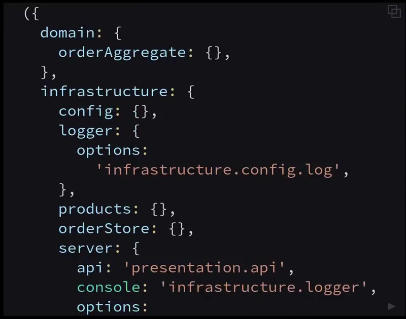
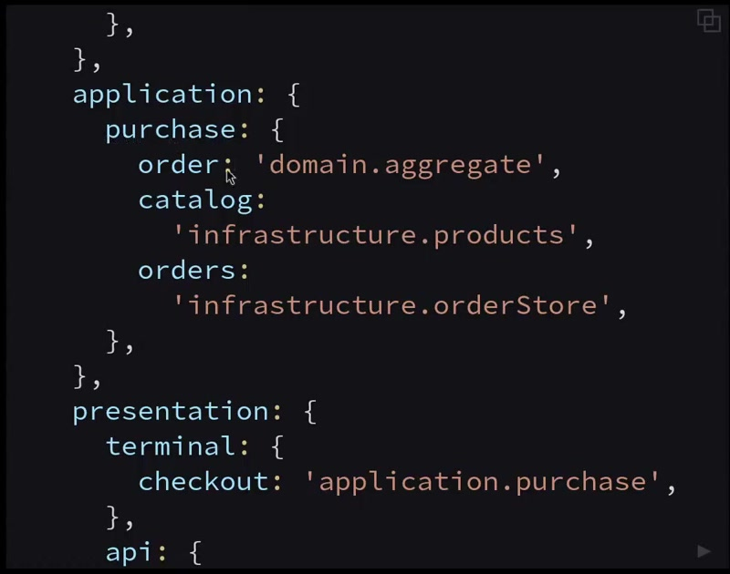
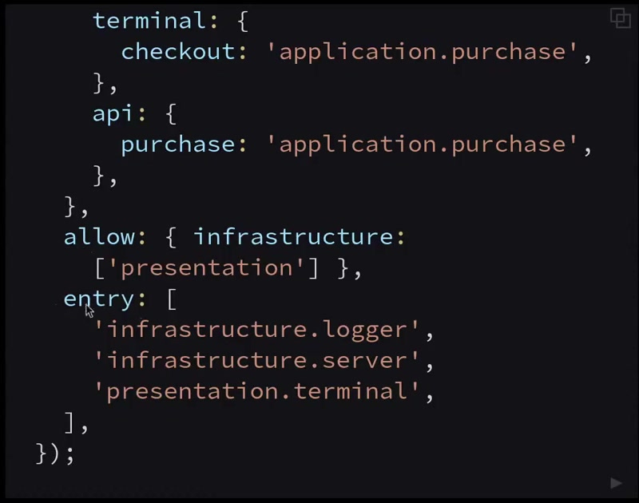
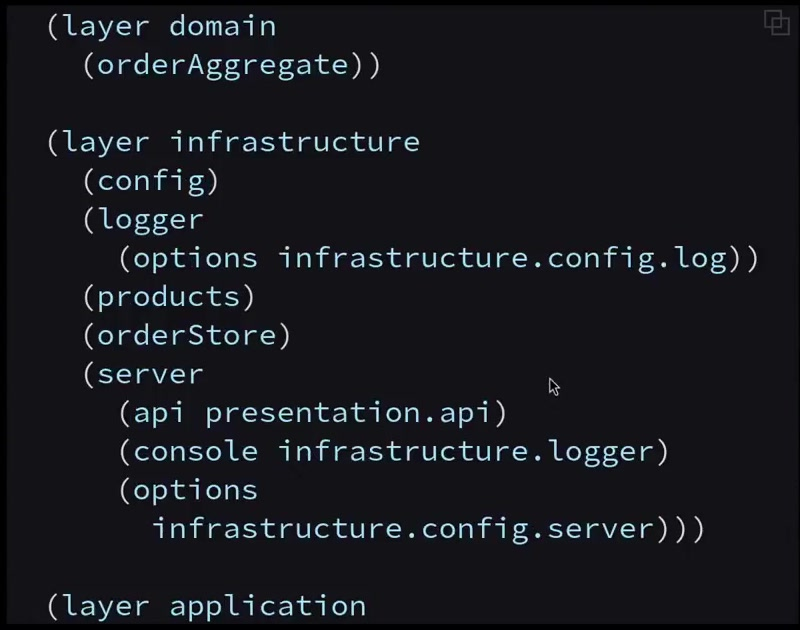
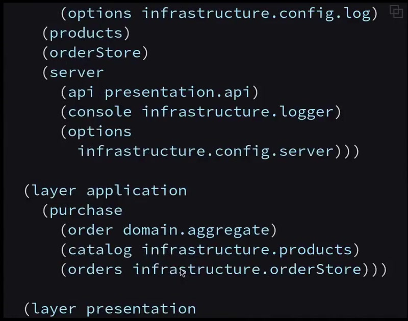
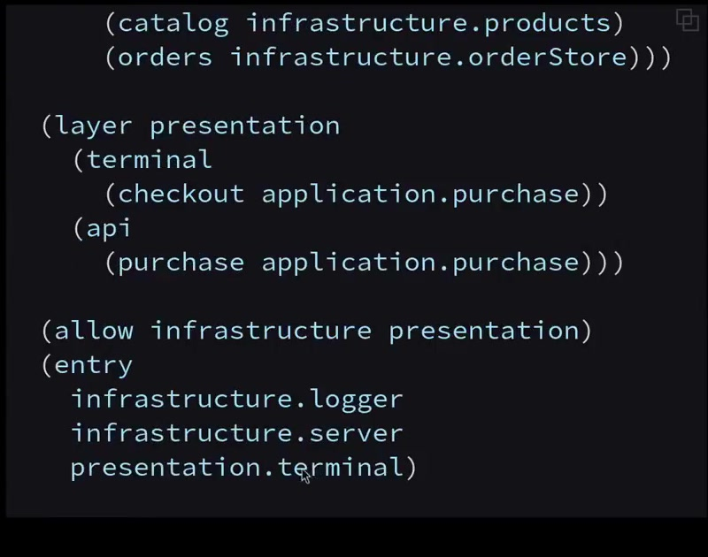
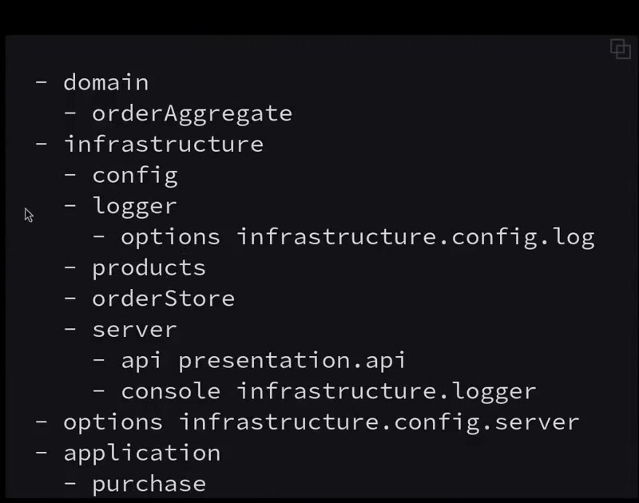
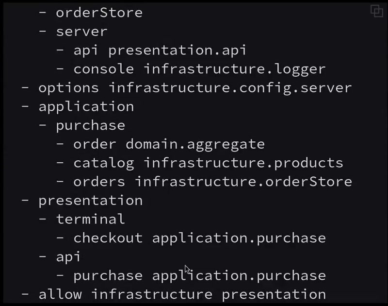
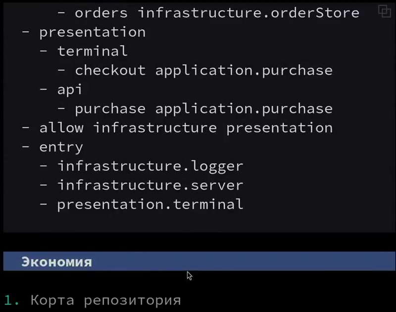

# Архітектурна мова (Шемсединов) — код зі слайдів

Джерело: «Разработка архитектуры при помощи AI», фрагмент 02:28:39–02:34:36.
Код переписано з кадрів відео (`slides/`), а не з переказу NotebookLM.
Транскрипт — `transcript_02-27-00_02-35-00.txt`.

## Структура

Опис — це дерево: **шар → модуль → залежність**.

| Рівень | Що це | Приклад |
|---|---|---|
| шар | `domain`, `infrastructure`, `application`, `presentation` | `infrastructure` |
| модуль | ключ у шарі; порожній `{}` — модуль без залежностей | `logger`, `config` |
| залежність | `ім'я: 'шар.модуль[.шлях]'` — що інжектиться в модуль під цим ім'ям | `options: 'infrastructure.config.log'` |
| `allow` | які шари може бачити шар поза звичайним порядком | `infrastructure: ['presentation']` |
| `entry` | модулі, з яких стартує застосунок | `'infrastructure.server'` |

Посилання — крапковий шлях у дереві. Ім'я залежності локальне для модуля:
`server` отримує логер як `console`, а не як `logger`.

Як виконується (зі слів автора, 02:29:08–02:29:32):
1. Усі модулі завантажуються в довільному порядку.
2. У кожен інжектиться тільки те, що описано в його залежностях (через конструктор) — до решти системи модуль доступу не має.
3. Імпорти в JS/TS-коді можна перевизначити тут: той самий `order` може прийти з різних модулів, у т.ч. за умовою (продажі vs бухгалтерія).

## JavaScript



```js
({
  domain: {
    orderAggregate: {},
  },
  infrastructure: {
    config: {},
    logger: {
      options: 'infrastructure.config.log',
    },
    products: {},
    orderStore: {},
    server: {
      api: 'presentation.api',
      console: 'infrastructure.logger',
      options: 'infrastructure.config.server',
    },
  },
  application: {
    purchase: {
      order: 'domain.aggregate',
      catalog: 'infrastructure.products',
      orders: 'infrastructure.orderStore',
    },
  },
  presentation: {
    terminal: {
      checkout: 'application.purchase',
    },
    api: {
      purchase: 'application.purchase',
    },
  },
  allow: { infrastructure: ['presentation'] },
  entry: [
    'infrastructure.logger',
    'infrastructure.server',
    'presentation.terminal',
  ],
});
```




## Lisp

У рантаймі перетворюється на JavaScript і виконується (02:33:46).



```lisp
(layer domain
  (orderAggregate))

(layer infrastructure
  (config)
  (logger
    (options infrastructure.config.log))
  (products)
  (orderStore)
  (server
    (api presentation.api)
    (console infrastructure.logger)
    (options
      infrastructure.config.server)))

(layer application
  (purchase
    (order domain.aggregate)
    (catalog infrastructure.products)
    (orders infrastructure.orderStore)))

(layer presentation
  (terminal
    (checkout application.purchase))
  (api
    (purchase application.purchase)))

(allow infrastructure presentation)
(entry
  infrastructure.logger
  infrastructure.server
  presentation.terminal)
```




## Markdown

Той самий опис вкладеними списками: `- ім'я` — вузол, `- ім'я шлях` — залежність.



```markdown
- domain
  - orderAggregate
- infrastructure
  - config
  - logger
    - options infrastructure.config.log
  - products
  - orderStore
  - server
    - api presentation.api
    - console infrastructure.logger
- options infrastructure.config.server
- application
  - purchase
    - order domain.aggregate
    - catalog infrastructure.products
    - orders infrastructure.orderStore
- presentation
  - terminal
    - checkout application.purchase
  - api
    - purchase application.purchase
- allow infrastructure presentation
- entry
  - infrastructure.logger
  - infrastructure.server
  - presentation.terminal
```




## Неточності на самих слайдах

- **Markdown:** `- options infrastructure.config.server` стоїть на верхньому рівні, хоча в JS і Lisp це залежність `server`. Мав би бути відступ на 4 пробіли.
- **Всі три варіанти:** `order: 'domain.aggregate'`, хоча в `domain` модуль називається `orderAggregate`. Шлях не резолвиться — або помилка на слайді, або є alias, якого не показали.

## Чого в показаному коді немає

Автор прямо каже, що показав не весь синтаксис (02:32:36). Адаптери, композиція (напр. `api` + `logger`) і перенаправлення подій **описані лише усно** — синтаксису для них у відео немає.

## Розбіжності з NotebookLM

NotebookLM не мав відео, тільки транскрипт, тож приклади коду в ньому вигадані:

| NotebookLM | Насправді на слайдах |
|---|---|
| `inject: [...]` масивом | іменовані залежності `ім'я: 'шлях'` |
| `(architecture ...)` в Lisp | окремі форми `(layer ...)`, `(allow ...)`, `(entry ...)` |
| `rules: { allow }` | `allow` на верхньому рівні |
| `entry: true` у модулі | `entry` — список шляхів на верхньому рівні |
| `server` у `presentation` | `server` в `infrastructure` |
| `purchases`, `dataStore`, `domain.order`, `domain.catalog` | `purchase`, `products`/`orderStore`, `orderAggregate` |
| `composition`, `events`, `flow` | такого синтаксису у відео немає |
| «Markdown удвічі скорочує код» | удвічі більше коду саме у варіанті зі структурою даних `{ text, hot }` проти Markdown + утиліта (02:28:16) |

## Для ідеї keylang

Markdown-форма вже майже те, що потрібно: дерево `шар → модуль → залежність`, і кожне ім'я — точка прив'язки до коду. Щоб наведення/перехід працювали, кожному вузлу треба знати `файл:рядок` — його можна отримати з AST (експорт модуля, його конструктор/фабрика та параметри), а залежності-шляхи — з того, що інжектиться. Автоматичного перетворення кодової бази в цей формат автор не показував.
