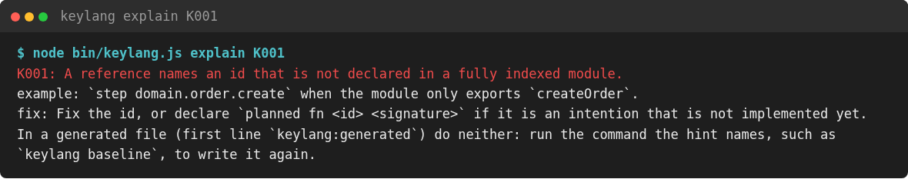
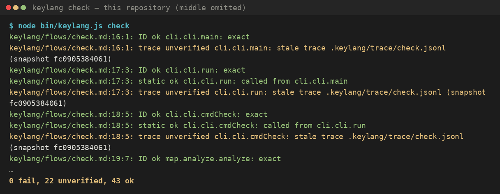
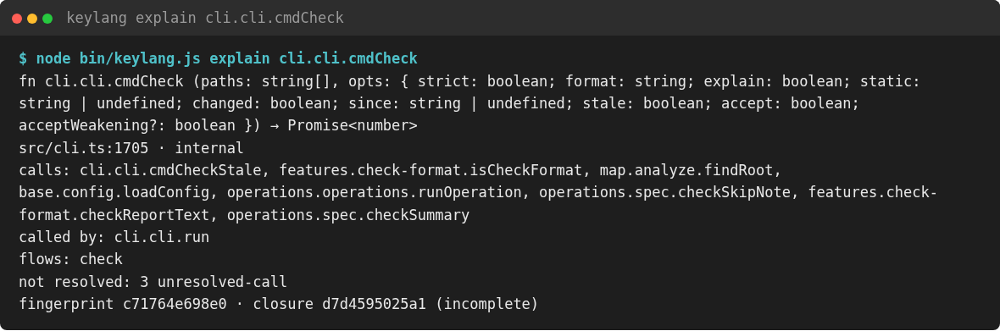

# 2. Install, check, explain

[Course](README.md) · **English** · [Українською](uk/02-install-and-check.md)

As before, you write the spec and an agent generates the functions, so you do not write them yourself. keylang does not start the agent; the commands in this lesson are what check the result.

You need Node.js ≥ 22.18. The package does not compile any native code during installation. Voice input is optional: the voice modules (`@fugood/whisper.node`, `decibri`) are not installed with keylang, and keylang works without them. To enable local voice, install them next to keylang; `keylang doctor` prints the command.

```sh
npx keylang init .     # layers, keylang.json, the map, a baseline, harness files
npx keylang check      # resolve ids and evaluate rules under keylang/
npm i -g keylang       # afterwards: keylang check
```

In this repository's own checkout, the entry point is `node bin/keylang.js`, which loads the TypeScript sources directly. A package installed from npm loads the compiled `dist/` instead.

`init` writes `keylang.json`, the map and `keylang/rules.baseline.md`. The baseline denies each layer every layer it does not already depend on. A layer that already imports packages is allowed those packages and denied the rest of `external`. Because the baseline describes the graph `init` has just seen, it adds no new `fail` right after `init`. Later, though, a new import across one of those gaps is reported as K102 until you change the rule or run `keylang baseline` again.

Unless you pass `--agents=none`, `init` also writes a managed block in `AGENTS.md` between `<!-- keylang:begin -->` and `<!-- keylang:end -->`, and leaves any text outside those markers as it was. If `.claude/`, `.codex/`, `.cursor/` or `opencode.json` already exists, the same run registers an MCP server named `keylang`, copies the `keylang-feature` skill, and, for Claude and Codex, adds a Stop hook. A skill directory that keylang created itself does not count as a sign that Claude is installed, so running `init` a second time does not keep adding adapters. `keylang agents` repeats that install on a repository that already has `keylang.json`. With `--check`, `init`, `agents` and `baseline` write nothing and exit 1 when the generated text is out of date.

A layer name must be a single id segment. Reserved names (`external`, `unassigned`, and the map keywords `layer`, `allow`, `deny`, `entry`, `module`, `no-cycles`) get a trailing `_`, and `init` reports the rename on stderr. If there is no `keylang.json`, later commands guess the layers from the directory structure.

## The commands you use first

| Command | Writes files? | What you read |
|---|---|---|
| `keylang check [paths…]` | No | Findings on stdout, `N fail, M unverified, K ok` on stderr. `--changed` keeps only findings that touch files changed since `HEAD` (or `--since`), plus untracked files, including a deleted file that a flow still names |
| `keylang baseline` | `keylang/rules.baseline.md` | The generated deny/allow frame. `--check` exits 1 and names `keylang baseline` when the file no longer matches |
| `keylang feature <slug>` | No | Whether `keylang/features/<slug>.md` is done. Exit 0 means done, 1 means gaps, 2 means the file is missing |
| `keylang agents` | Harness files outside `keylang/` | The same adapters as `init`. `--agents=none` removes that install and keeps the baseline |
| `keylang map [dir]` | `keylang/map/*.md`, `.keylang/index.json`, and `keylang/map-explained/` when `explain.map` is on | Refuses to overwrite a map file that has no `keylang:generated` marker |
| `keylang map --check` | No | Exit 1 when the committed map differs from a fresh render, or a map file lacks the marker |
| `keylang explain K001` | No | Why the diagnostic code exists, a short example, and a fix |
| `keylang explain <id>` | No | Kind, signature, file, calls, callers, flows and rules, plus `fresh` or `stale` for a saved explanation |
| `keylang explain <id> --llm` | `keylang/explain/<id>.md` | Prose from the configured agent. It never changes a verdict |
| `keylang fmt <file>` | The file | Exit 1 on a structural error, or, with `--check`, when the file was not canonical |
| `keylang parse <file>` | No | A text dump. With `--json`, stdout holds only the JSON and diagnostics go to stderr |
| `keylang doctor` | No | Languages, whether an agent key is set, and voice support. Exits 0 even when it reports a problem |

By default, `check` reads the spec directory named in `keylang.json`, usually `keylang/`. If you pass a path such as `examples/shop`, it checks that tree instead.

| Code | Meaning |
|---|---|
| 0 | No blocking finding |
| 1 | A violation; a stale map, baseline or harness under `--check`; or any `unverified` when you passed `--strict` |
| 2 | Bad arguments or an I/O error. The message names the file and, for config errors, the field |

`--format` does not change the exit code. `human` is the default, while `json`, `sarif` and `github` are meant for CI.

## A wrong name, then a clean one

`examples/shop` contains one deliberate mistake: the purchase module depends on `domain.aggregate`, but the module that actually exists is `domain.orderAggregate`.


The output tells you three separate things:

1. `K001` is an error: the name does not resolve. The hint suggests the nearest existing id, and the exit code is 1.
2. The second line is `unverified`, not another error. This example has no source files, so there is nothing to prove the flow against. `no snapshot` means "not proved," not "broken."
3. One failure is enough to fail the whole process. The unverified line on its own would not, unless you pass `--strict`.



`examples/shop-fixed` spells the name correctly as `domain.orderAggregate`. There is still no code, so the flow stays unverified, but nothing is broken, and the process exits 0:


"No violation" and "every claim proved" are different things. Use `--strict` when a gap in the evidence must fail the pipeline. Keep the default when, for example, a fresh clone has no test reports yet and you only want structural failures to go red.

If the name is a real intention and the code simply has not been written yet, declare it as planned:

```markdown
- planned fn domain.orderAggregate.create (items: Item[]) → Order
```

A reference to a `planned` id does not produce K001. Instead, its `ID` evidence is `unverified` with the reason `planned`. When the symbol later appears in the code with the same kind and signature, the declaration turns into warning K202, a reminder that the `planned` line can now be dropped. If the kind or signature differs, you get error K201.

## This repository

Running `keylang check` at the root of this repository rebuilds the snapshot and evaluates `keylang/rules.md`, without writing the map. The run in the screenshot printed no failures:



`ID ok` means the symbol is present in the fresh snapshot. `static ok` means a call path from the parent step was found, here "called from `cli.cli.main`." `trace unverified` means the trace file was recorded for a different snapshot. Run `npm test` to regenerate `.keylang/reports/` and `.keylang/trace/`. Until you do, `--strict` exits 1, while a normal `check` exits 0.



`internal` means the function is not part of the module's public exports. `closure … (incomplete)` means that something reachable from the function is dynamic or unresolved, so the fingerprint is not a complete proof of its behavior.

## Formatting

`keylang fmt` rewrites a file from its parse tree. Bullets become `-`, tokens are separated by a single space, and the file ends with exactly one newline. Running it a second time changes nothing. A file with a structural error (an odd indent, a tab, an empty item) is left untouched and reported as K003, because a formatter that guessed the intended tree could change the meaning.

`keylang parse --json file.md` outputs the IR for other tools to consume. Diagnostics go to stderr, so stdout piped into another program stays valid JSON.

## The config you will open

`keylang.json` at the repository root also marks where the root is.

| Field | Role |
|---|---|
| `format` | Language edition. If the field is omitted, edition 1 applies. With no `keylang.json` at all, the current edition, 2, is used. Edition 2 lets an incomparable `deny` win |
| `languages` | A subset of `javascript`, `php`, `python`, `rust`, `typescript`. If omitted, detected from file extensions |
| `module` | `file` (the default when languages disagree) or `dir` |
| `layers` | Layer name → list of globs. Key order sets the order of colors and of the tree |
| `exclude` | Globs that stay in the snapshot as opaque modules |
| `dir` | Spec directory, `keylang` by default |
| `check.tests` | A keylang JSON report or JUnit XML |
| `check.trace` | Trace JSONL |
| `check.static` | `behavior` (default) or `shape`. A command-line flag overrides the file |
| `agent` | Optional. `anthropic:<model>` or `openrouter:<model>`, used by `explain --llm` and drafts |
| `explain.map` | Optional. `true` also writes `keylang/map-explained/`. `check` does not read it |

Without `check.tests` and `check.trace`, those kinds of evidence are not printed and do not affect `--strict`. This repository points both at `.keylang/`, which is gitignored, so CI that wants trace evidence has to produce those files within the job itself.

Next: [the language](03-the-language.md).
