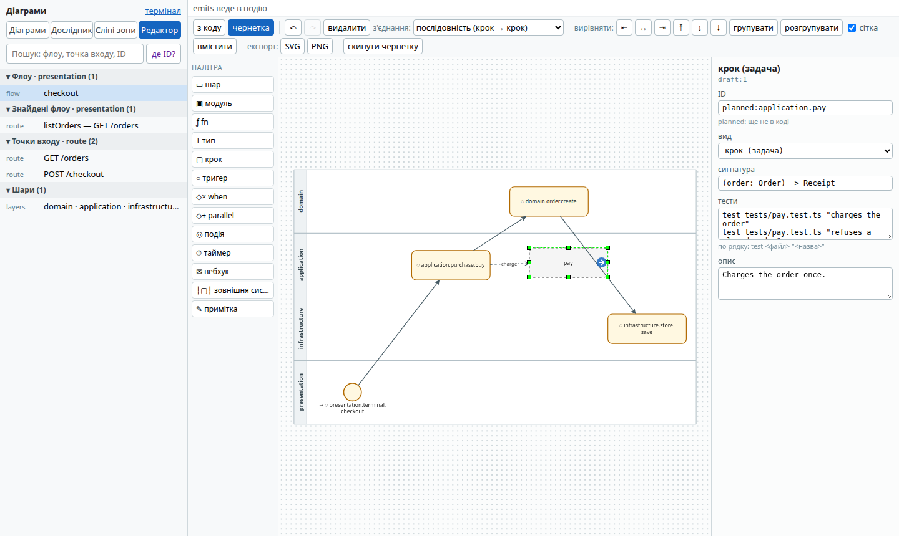

# 7. Wiring, the UI, and agents

[Course](README.md) · **English** · [Українською](uk/07-tools.md)

Rules and flows check the code that the agent generated: you wrote the spec, not the functions, and keylang itself never starts the agent. On top of that same analysis sit three more surfaces: a wiring generator, the UI in the terminal and the browser, and the tools for agents. None of them produces a second verdict of its own, so whatever they show, `check` stays the one source of truth.

## Wiring

The `# wiring` section lists factories. From it, `keylang wire` writes `keylang.gen.ts`, which contains a typed `async function wire(env)` that builds each factory once, dependencies first. There is no container and no lookup by string, so the result is plain code you can read. The contract is described in [ADR 0003](../adr/0003-wiring-lifecycle.md).

```markdown
# wiring

- wire app.purchase.createPurchase
  - store domain.store.Store
- wire domain.store.Store
  - db infra.db.createDb
    - when env.DB = memory → infra.memory-db.createMemoryDb
    - compose infra.logged.logged
```

`wire <id>` names either a function that is called with an object of named dependencies or a class that is constructed with that object. Each child line `<alias> <id>` is one dependency. An id that has no `wire` line of its own is a leaf and is built with no arguments. A line `when env.NAME = value → <id>` picks another implementation when the variable has exactly that value; the first match wins, and the dependency line itself is the fallback when nothing matches. `compose <id>` wraps the value. When there are several `compose` lines, they apply in source order, with the first one closest to the value.

Mistakes in the section turn into diagnostics. An unknown id is K001, and a repeated `wire` id is K002. A cycle among factories is K301. K302 means the generated file cannot build the target, because it is a module, a type, Python or Rust code, an instance method, or a name the module does not export; a static method, however, is allowed. A `deny` rule between a factory and one of its dependencies is K102.

`keylang wire` will not overwrite a file that lacks the `// keylang:generated` marker and exits with code 1 instead. If the section has any diagnostic, nothing is written. `--check` only compares and writes nothing. The generated file is an ordinary module in whatever layer its path falls into, so the same `deny` rules apply to it. Its types are checked by `tsc`, not by keylang.

Wiring does not isolate modules: a hand-written import simply bypasses `wire()`, and it is the rules that catch such imports. Rust generation and request-scoped lifetimes have been designed but are not in the tool yet.

## The terminal and the browser

Run `keylang` with no command and it opens the UI when stdin and stdout are a terminal; otherwise it prints usage and exits with code 2. `keylang web` serves the same UI at `http://127.0.0.1:7070/#t=<token>`. The token sits in the URL fragment, which the browser does not send to the server. Localhost is the default. If you choose another `--host`, only the token protects the UI, so for remote use an SSH tunnel to localhost is the safer setup.

The screen shows the spec, a gutter with a mark beside each line, a status line, and a tree. `?` opens the list of keys:


`?` opens that list, and Esc closes it again:


| Key | Action |
|---|---|
| `↑` `↓` or `j` `k` | Move |
| `Enter` | Open the code for the id |
| `K` or hover | Show the signature, the file, the evidence |
| `Tab` | Editor, then the tree, then the file list |
| `F2` / `F3` | Show or hide the file list / the navigation panel |
| `F5` | Analyze again |
| `F6` | The current analysis and the results of operations |
| `F7` | The chat with the built-in assistant (the paper clip), which proposes spec changes only |
| `v` | Reading mode; the gutter stays tied to source lines |
| `i` | Edit; generated maps refuse |
| `/` then `n` | Search this buffer |
| `:` | Command palette; `open keylang/rules.md` jumps to a file |
| `t` | On a layer file, switch between the map and the explained map |
| `s` | Find a node by id or by words in its note |
| `m` | Merge the proposal for this file, hunk by hunk |
| `q` | Quit |


`Enter` on an id opens a read-only viewer when no `$EDITOR` is set, and always does so in `keylang web`. In a terminal with `$VISUAL` or `$EDITOR` set, that editor is used instead. `Esc` takes you back:


While you edit, `Ctrl+S` writes the file and `Ctrl+Space` completes keywords and ids. `Ctrl+G` turns the selected prose into `step`, `when` / `then`, `invariant` or `emits` lines. It does not call a model: it only recognizes ids the snapshot already has, plus a few cue words (`when`, `if`, `коли`, `якщо`).

`keylang web <url>` first clones the repository the way `keylang clone` does (see [the first hour](existing/01-the-first-hour.md)) and then serves the UI on the clone.

The repository has a `Dockerfile` for running keylang with git inside a container. Clones go to the `/cache` volume, and `/work` is the folder you mount:

```sh
docker build -t keylang .
docker run --rm -v keylang-cache:/cache keylang clone https://github.com/owner/repo
docker run --rm -p 127.0.0.1:7070:7070 -v keylang-cache:/cache keylang web https://github.com/owner/repo --host 0.0.0.0
docker run --rm -v "$PWD":/work keylang check
```

Inside a container the server has to listen on `0.0.0.0`, so the token is the only guard; `127.0.0.1:` in `-p` keeps the port on your machine. In the printed URL, replace `0.0.0.0` with `localhost`.

## The diagram page

`keylang web` also serves a page of diagrams. The «Діаграми» link at the top right of the terminal page opens it in a new tab with the same token; the page's labels are in Ukrainian.


The list on the left holds the flows, the discovered flows, the entry points and the layer view. The canvas draws the chosen view as BPMN-style shapes, one lane per layer, colored by the same verdicts as the gutter. The panel on the right shows the selected shape's id, its place in the code and in the spec, and its `check` results. Four modes sit above the list: Diagrams (Діаграми); Explorer (Дослідник), an entry point's call tree from which you can save a flow as a proposal; Blind spots (Сліпі зони), the `keylang coverage` report; and Editor (Редактор).



In the editor, a view taken from the code (з коду) lets you change only its layout, while a draft (чернетка) is fully editable. You drag a layer, a step, a trigger, a `when`, a `parallel`, an event or a timer from the palette, and connect shapes with a meaning: sequence, call, dependency, `allow`, `deny`, `emits` or `continues`. A new shape gets a `planned:` id. `Ctrl+Z` and `Ctrl+Y` undo and redo, SVG and PNG export the picture in the browser, and `Ctrl+C` / `Ctrl+V` copy shapes between tabs, even between two `keylang web` servers, as a `flow export` bundle. The layout goes to `keylang/diagrams/<view>.layout.json`, which you commit so the team sees the same picture. «Запропонувати зміни» (propose changes) turns the drawing into proposals for the specs it changes, as `keylang diagram propose` does. Nothing on the page writes a spec directly.

`keylang web --new <dir>` starts a project from a drawing. It opens the editor on an empty canvas with a template of lanes, and the button «Створити специфікацію» writes `keylang.json`, `rules.md`, the features and the layout, but only the files that do not exist yet. The [from-scratch track](from-scratch/README.md) walks through it.

The same views also leave the browser as files. `keylang export bpmn <flow>` writes BPMN 2.0, `keylang export drawio <view>` a draw.io file, and `keylang export c4` a C4 diagram for PlantUML or Mermaid. `keylang import drawio <file>` reads a drawing someone changed in draw.io back as one proposal for the flow's spec. `keylang flow export <name>` packs flows into one portable Markdown bundle; in another repository, `keylang flow import` proposes them as a feature on `planned` nodes, plus rows of `keylang/migration.md`, and `keylang migration status` then reports, flow by flow, whether the new stack has the counterpart and whether the same tests pass in both.

`keylang lsp` serves the same diagnostics over stdio. The client in `editors/vscode/` is a thin wrapper around it; it is not published in the Marketplace and is not part of the npm package.

## Agents

keylang does not launch an agent. Instead, `init` and `keylang agents` write a short instruction block and, where they find Claude, Codex, Cursor or opencode, also install the MCP server and the skill. Which directories they look for is listed in [lesson 2](02-install-and-check.md). The division of work stays the same: you write the spec, the agent generates the program from it, and you do not write the functions yourself. Whatever the agent produces, `check` still has the final word.

A feature file is an ordinary spec. `keylang feature <slug>` reports the feature as done when every `planned` item is implemented, every step is static `ok`, and no rule `fail` remains. Tests and traces are shown, but they do not block it.

For Claude and Codex, keylang also installs a Stop hook, which runs when the agent is about to finish. `keylang hook stop` runs the check on what changed. If a new `fail` appeared, or the spec was weakened since `HEAD` (K108), it answers `decision: block`, so the agent has to keep working. If there is no new `fail`, or the same event arrives again with `stop_hook_active: true`, it answers `{}`. Either answer is JSON with exit code 0. When it cannot check the turn at all (no git, a broken `keylang.json`), it answers with a `systemMessage` that the harness shows to you without blocking the agent. An unverified line does not block. Cursor uses Claude's hooks, while opencode does not get a Stop hook at all.

Hand-written rules change only through a proposal. `apply_diff` stores the new text and leaves the file itself untouched until you merge it, and it refuses to touch a generated file.

| Command | What it proposes | What it will not do |
|---|---|---|
| `draft flow <trigger>` | A flow under `.keylang/proposals/` | It does not edit the spec. `--mode algo` follows resolved calls to depth 4 |
| `draft rules` | Rules the code already satisfies, or the model's rules tagged `agree`, `conflict`, `llm-only` | It does not weaken a `deny` you wrote unless you merge that hunk |
| `draft map` | Nothing; it only prints a layout | The file changes only when you edit it |
| `code-to-spec <file:line>` | Flows for the function, or for every exported function | `--since <git-ref>` limits the draft to functions the diff touches |
| `spec-to-code <id>` | A stub and failing tests for a `planned fn` | Files are written only with `--apply`, not by default |
| `draft flow --from-trace <file>` | A flow from what one trace run observed | Steps static does not see are marked as observed, not proved |
| `flows adopt <name>` | A discovered flow as a spec | `flows discover` itself writes only the generated view |
| `diagram propose`, `import drawio` | The changes of a drawing, one proposal per spec | New layers for `keylang.json` are only printed |
| `explain <id> --llm` | `keylang/explain/<id>.md` | It never changes a verdict |

`keylang mcp` serves search, node, code, flows, check, explain, context, `validate_spec`, `scaffold`, `feature_status`, `list_entries`, `discover_flows`, `coverage_report`, `list_integrations`, `project_tour`, `migration_status`, and `apply_diff`. Of these, only `apply_diff` writes anything, and what it writes is only a proposal.

In the UI, `m` opens the diff. `a` accepts a hunk, `r` rejects it, and `w` writes the accepted hunks. A hunk you have not decided on is not applied. Outside the UI, `keylang proposals` lists what is pending, `proposals show <target>` prints the diff, and `proposals accept` or `proposals reject` settle it. Accepting is for a person, never for an agent.

In view mode, `Ctrl+Space` on a flow that has a trigger asks the model for a draft and opens the merge. This needs a model: `agent` in `keylang.json`, or `KEYLANG_AGENT`, as in [lesson 2](02-install-and-check.md). After you merge, `check` evaluates the new steps like any other steps, so a line the snapshot does not support becomes `unverified` or `fail`, never `ok`.

Ghost text is a single suggested line at the end of a fresh `- ` bullet, and `Tab` inserts it. Voice input (`Ctrl+R` while editing) is optional, and `keylang doctor` tells you which engine is set. Neither of them writes a file on its own.

So let the tool propose, read each hunk, and accept the ones that say what you meant. When in doubt, believe `check`, not a comment saying that a model wrote the line.

Next: [the sessions](08-use-cases.md).
