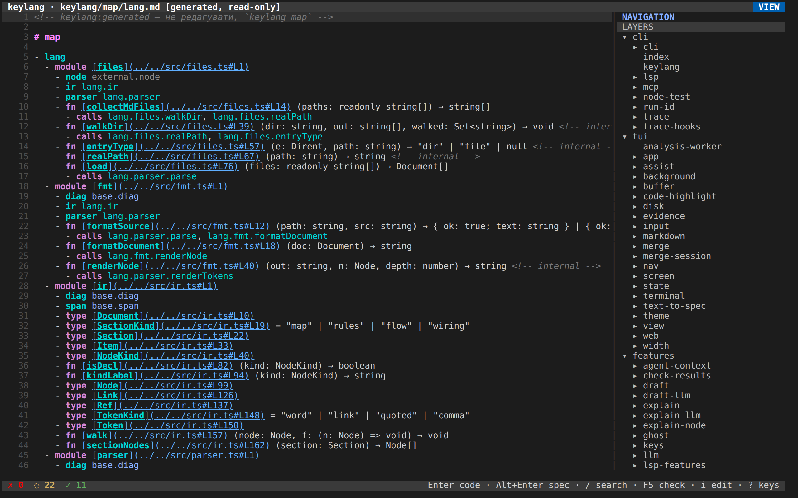

# 8. Use cases

[Course](README.md) · **English** · [Українською](uk/08-use-cases.md)

Here are six sessions taken from this repository, from `examples/shop`, and from a repository you have not seen yet. In each of them you write the spec, and the agent generates the functions; you do not write those yourself. Every session tells you what to run, what the picture shows, and which decision it helps you make.

The UI screenshots were taken from `keylang web` on 2026-09-28. At that moment the trace and test files under `.keylang/` were stale, and the CLI summary for the same tree was `0 fail, 22 unverified, 43 ok`.

## 1. A renamed module

Someone writes `order domain.aggregate` under `application.purchase`, but the module on the map is called `orderAggregate`.

```sh
node bin/keylang.js check examples/shop
```


The first line is the one that decides: the name is a typo or a stale name, so the process fails. In the screenshot the hint suggests the nearest existing id; today it says `run keylang map` instead, because the example's map carries the generated marker ([lesson 2](02-install-and-check.md) shows the current output). The second line reports a different fact. The example ships no source code, so the rules cannot be checked and the checkout flow cannot be proved. To fix the first problem, correct the id (see `examples/shop-fixed`). If the module really does not exist yet, declare it `planned` instead and accept `unverified` until the code arrives.

```sh
node bin/keylang.js explain K001
```


The UI shows the same paragraph when you press `?` on the diagnostic.

After the fix, the process exits with 0, but the flow is still not proved:


Do not read that as "the shop is verified." It means something narrower: "the names that can be resolved do resolve, but there is no code to check the rules against."

## 2. A layer rule you want CI to keep

This repository has a rule that the parser and the checker import neither the tree-sitter extractor nor `web-tree-sitter` directly. The TUI follows the same idea: it asks the analysis for facts and does not parse source code itself.


- The gutter on the rule lines shows `✓`, which means every criterion held.
- The colors follow the layer order in `keylang.json`.
- The tree on the right is the snapshot itself, not a drawing.
- The status line reads `✗ 0  ◌ 22  ✓ 11`: zero failing lines, twenty-two lines whose worst mark is unverified, and eleven lines that are fully ok. Those eleven are the rules.

In CI, run both commands. Neither of them writes files:

```sh
node bin/keylang.js check
node bin/keylang.js map --check
```

`check` fails if a new import crosses a `deny`, and `map --check` fails if someone changed the code but did not regenerate the map. For example, a pull request that adds `import web-tree-sitter` to `src/parser.ts` fails with K102 on that import, while the rules file remains the place that explains why.

`draft rules` can suggest a `layers` line based on whatever the code does today. Treat that as a description of the present, not of what you want, and edit it into the rule you actually want before you merge it.

## 3. A flow that is partly proved

Open `keylang/flows/check.md` and put the cursor on the trigger.


| Mark | Reading |
|---|---|
| `ID ✓` | `cli.cli.main` is in the fresh snapshot |
| `static —` | Not reported, because a trigger has no parent call |
| `tests —` | Not reported on this line |
| `trace ◌` | Reported, but the trace file belongs to another snapshot |

A single green badge would have hidden the stale trace. Instead, the yellow line names `.keylang/trace/check.jsonl` and the old snapshot id, so you can see exactly what is out of date.


`Enter` opens the function in a read-only viewer, and `Esc` takes you back. The viewer does not edit the TypeScript.


To make the trace `ok`, run the test suite so that the reporter rewrites `.keylang/` for the current `snapshotId`, and then run `check` again. Until the hashes match, `◌` is the honest mark. If the pipeline must refuse that state, pass `--strict`. If you have not adopted traces at all, delete `check.trace` from `keylang.json`, and that kind of evidence stops being reported.

Here is the same picture in the CLI, with the middle cut out:


`static ok` on `cli.cli.run` comes from the call in `main`. Further down, `generateMap` is reached through the default value of the hook `generate`. `--static=behavior` counts that path, while `--static=shape` would not. The CLI picture is newer than the UI ones, so its summary has more results than the `0 fail, 22 unverified, 43 ok` of that day; on one tree the two agree once you remember that the UI counts lines and the CLI counts results.


## 4. Reading the repository before editing it

1. Run `keylang web`, or `keylang` in the terminal.
2. Press `:` and type part of a path.

   

   Here is the same gesture, after which the cursor walks down the denies. It was recorded after `npm test`, so the status line is all green:

   

3. Press `F2` for the file list. Specs sit above the generated map.

   

4. On a generated map, press `Enter` on a function. The file is marked `generated, read-only`, so do not hand-edit the Markdown: change the source instead, then run `keylang map`.

   

5. Press `v` to read the prose as a document. The gutter stays in place.

   

6. Press `?` when you forget a key, and Esc to close the list.

   

After that, press `i` to change a rule and `Ctrl+S` to write it. On a checkout the agent has not seen yet, `keylang init` writes the baseline and, where a harness is already present, the MCP server. keylang still does not launch the agent itself. Drafts land in `.keylang/proposals/`, and you are the one who merges them, with `m`.

## 5. Words on the map, and a feature that is not done

There is no screenshot for this session.

Turn on `"explain": {"map": true}`, run `keylang map`, open a layer file and press `t`. You will see the same tree, but with a doc comment or a saved brief under each node, and `s` finds a node by its id or by those words. Keep in mind that `check` does not read `keylang/map-explained/`, so a green run does not claim that any of those paragraphs is true.

Work that is not in the code yet lives in `keylang/features/<slug>.md` as `planned` ids and a flow. You write that file, and an agent generates the functions from it; you do not write them, and keylang does not start the agent. An integration that nothing imports yet is written as `planned module external.<pkg>` plus a step from the module that will import it. `keylang feature <slug>` reports the feature as done when those declarations are implemented, the steps are static `ok`, and no rule fails. The tests and the trace are listed beside that answer, but they do not decide it.

## 6. A codebase you have never seen

There is no screenshot for this session either.

Someone hands you a repository with hundreds of entry points and no spec. Before any rule, find out what is there:

```sh
keylang init . --agents=none
keylang tour --out keylang/tour.md
keylang entries --kind route
keylang coverage
keylang integrations
keylang flows discover
```

`tour` writes one page: what the system says about itself, layers and modules with their size and coupling, business processes, entry points and events, integrations, blind spots, and the functions to read first. `entries` lists where execution starts; for a framework, its adapter has to find them. `coverage` shows which functions no entry point reaches and which modules have the most holes, and `integrations` lists the HTTP, SDK and queue clients the code calls, without contacting any of them. None of these is a verdict, and `check` reads none of them.

`flows discover` gives every entry point a draft flow under `keylang/flows-discovered/`. Pick the one or two scenarios people actually argue about, run `keylang flows adopt <name>`, and merge the proposal: from then on `check` keeps that flow honest. In `keylang web`, the same report is the Blind spots mode of the diagram page, and the Explorer walks an entry point's calls before any flow exists.

## When to leave it alone

keylang earns its keep when people already argue about layers and you want that argument to be able to fail a pull request. It is a poor fit when:

- The codebase is a single layer, or the boundaries move every week and nobody will keep the ids up to date.
- The bugs you care about never show up as an import or a call between modules.
- You need a language the frontends do not parse. A project made entirely of holes, places the analysis cannot see into, will report `unverified` forever.
- You want the prose checked against the code. That check is not implemented: `check` reads only the bullets, and `check --stale` only tells you which prose to reread because its code changed.
- You want a runtime injector for Rust. `keylang wire` emits a single TypeScript composition root.

A small adoption still pays off: `keylang.json`, a short `rules.md` with `layers` and two or three `deny` lines, `check` and `map --check` in CI, and no flows until some scenario is worth a trace.
