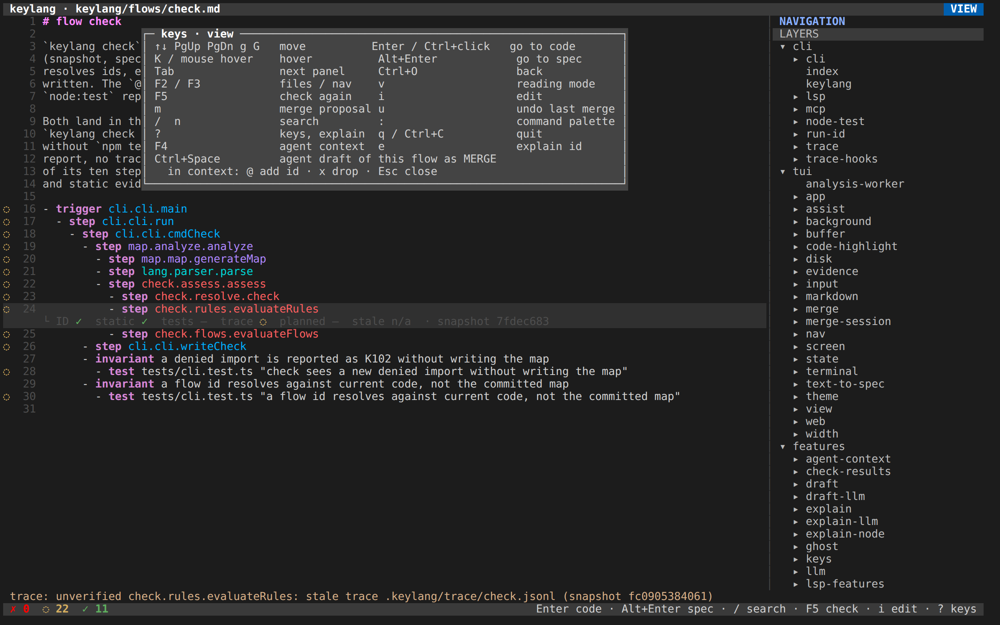

# 6. Потоки

[Курс](README.md) · [English](../06-flows.md) · **Українською**

Потік описує один сценарій. Як і з правилами, пишете його ви, а агент пише функції на цьому шляху. Різниця в охопленні: правила кажуть, які модулі можуть знати одне про одного, а потік простежує один шлях крізь них. Він складається з тригера, кроків під ним і доказів, які ви додаєте, щоб показати, що цей шлях справді працює.

`keylang/flows/check.md` описує сам `keylang check`:


Тут `/` знаходить `cli.cli.main`, а на рядку нижче `K` відкриває функцію. Ролик знято пізніше, після `npm test`, тому trace у ньому — `ok`. Знімок екрана вище показує старіший запуск, у якому trace був застарілим:


## Форма

```markdown
# flow checkout

- kind business
- trigger presentation.terminal.checkout
- step application.purchase.buy
  - reads infrastructure.products.find
  - step domain.orderAggregate.create
  - step infrastructure.orderStore.save
  - emits event order.created
- invariant total equals the sum of price times quantity
  - test tests/purchase.test.ts "computes total"
- when the item is out of stock
  - then application.purchase.OutOfStock
  - test tests/purchase.test.ts "rejects out of stock"
```

`kind` буває `business` або `technical`; це лише мітка, і ніщо її не перевіряє. Тригер — місце, де сценарій починається. Крок, вкладений в інший крок, — це виклик усередині батьківського, а сусідні кроки читаються як «спочатку це, потім те». Крок, записаний поруч із тригером, вважається вкладеним під тригер.

`reads` і `emits` — твердження, прикріплені до кроку, але `emits` з картою не звіряється. `invariant` і `when` — звичайна проза. `then` є посиланням, коли це один id з крапками, а інакше теж прозою. `test` прив'язує файл та ім'я тесту в лапках до твердження, під яким стоїть, і цей тест стає доказом цього твердження.

## Чотири рядки доказів

Кожен вид доказу — окремий результат, тому успіх одного не зафарбовує інші в зелене.

| Доказ | `ok` | `unverified` | `fail` |
|---|---|---|---|
| `ID` | Символ є у свіжому знімку | id має статус `planned`, або член лежить у непрозорому модулі | K001: модуль прочитано повністю, а члена в ньому немає |
| `static` | Від батька є шлях із розв'язаних викликів | Шлях може не виконатися, або шляху немає, але його могло б створити щось, за чим keylang не стежить | `absence`: ніщо досяжне не може назвати цей виклик |
| `tests` | Названий тест пройшов у звіті для цього знімка | Звіту немає, тест не знайдено чи пропущено, або звіт стосується іншого знімка | Тест упав |
| `trace` | Крок бачили в завершеному запуску, з правильним вкладенням і порядком | Trace зібрано для іншого знімка, запуск неповний, або гілка `when` не виконувалася | В завершеному інструментованому запуску бракує обов'язкового кроку, або крок почався раніше за попереднього сусіда |

На тригері зі знімка екрана смужка показує `ID ✓`, `static —`, `tests —`, `trace ◌`, де риска означає «не звітувалося». У тригера немає батька, тож статичний шлях доводити нема від чого. Файл trace зібрано для старішого знімка, тому trace — `unverified`. Позначка всього рядка — `◌`, найгірший зі звітованих видів, і це не `✓`, хоча id точний.

`K` відкриває ті самі факти разом із кількома рядками оголошення:


Від найгіршої до найкращої позначки такі: `✗` — збій, `◌` — якийсь обов'язковий вид має `unverified`, `!` — лише попередження, `✓` — кожен звітований вид `ok`, `◇` — оголошення `planned`.

`--static=behavior` (типовий режим) іде ще й за хуком. Це стосується типового значення `g` у `const g = p.x ?? f` і функції, яку передав викликач; повідомлення тоді каже `through the default of the hook` або `injected at file:line:col`. Натомість `--static=shape` іде лише за викликами, написаними в коді. `check.static` у конфігу — той самий перемикач, і якщо задано обидва, перемагає прапорець.

Статичний `fail` навмисно важко отримати. Якщо будь-який нерозв'язаний виклик іще міг би виконати крок, відповідь лишається `unverified`, тож збій означає, що keylang упевнений: виклику справді немає.

## Тести і trace

`check` сам не запускає ваших тестів і нічого не трасує. Натомість ви вказуєте в `keylang.json` файли, які створюють ці запуски:

```json
"check": {
  "tests": ".keylang/reports/*.json",
  "trace": ".keylang/trace/*.jsonl"
}
```

Якщо цих ключів немає, відповідні види доказів не друкуються, і `--strict` їх ігнорує. Якщо файли застарілі або їх немає, ви отримаєте `unverified`, як на знімку екрана.

Звіт тестів — це або власний JSON keylang (схема 1, його створює репортер `node:test` із цього пакета), або JUnit XML із властивістю `keylang.snapshotId`. JUnit-файл без цієї властивості не може підтвердити поточний код, бо ніщо не пов'язує його з цим знімком. Тест зіставляється за шляхом файла та ім'ям у лапках.

Trace — це JSONL, одна подія на рядок. Події `start` і `end` вкладаються одна в одну за `parentSpanId`. Порядок сусідніх кроків означає, що `end` попереднього стоїть перед `start` наступного на тому самому `clockId`; сортування за часом для цього недостатньо. Rust і Python тримають один годинник на процес.

| Мова | Як записувати |
|---|---|
| TypeScript / JavaScript | `node --import keylang/trace script`. За тутешньою домовленістю ім'я тесту містить `@flow <name>` |
| Python | `python3 adapters/python/keylang_trace.py script`, де `KEYLANG_TRACE_PLAN` вказує на вивід `keylang trace-plan <flow>` |
| Rust | `mod keylang_trace` з `adapters/rust/keylang_trace.rs`, `span("<id>")` у функції та `finish()` наприкінці `main`. Крок без інструментування лишається `unverified` |

`keylang trace-plan checkout` друкує функції, які треба інструментувати, разом із хешами файлів. Файл, що змінився після складання плану, не інструментується, і наступний `check` назве trace застарілим, бо `snapshotId` змінився.

## `planned`

Крок, що називає `planned fn`, не дає K001. Натомість `ID` і `static` мають `unverified` з причиною `planned`. Коли символ з'являється з тим самим видом і сигнатурою (пробіли не враховуються, а `->` і `→` вважаються однаковими), оголошення попереджає K202, що його можна прибрати. Якщо сигнатура не збігається, це K201.

Те саме оголошення може лежати й у `keylang/features/<slug>.md`. `keylang feature <slug>` вважається готовим, коли кожен `planned` там реалізовано, кожен крок має static `ok` і не лишилося жодного `fail` правил, зокрема й правил із baseline. Тести й trace теж друкуються, але на цю відповідь вони не впливають.

Пакет, якого ще ніхто не імпортує, записують як `planned module external.<pkg>` разом із кроком від модуля, що його імпортуватиме. Доки цей модуль його не імпортує, крок лишається `unverified`. Щойно імпорт з'явиться, оголошення дасть K202, а крок отримає static `ok`.

`spec-to-code <id>` пропонує заготовку, що кидає `not implemented`, а також тест, що падає, для кожного відсутнього тестового файла, який називають потоки. Коли ви їх приймете, перевірка id може пройти, і K202 запропонує прибрати `planned`. Проте тести лишаються `fail`, доки агент не напише справжню функцію і справжній тест за тією самою специфікацією, бо заготовка — ще не фіча.

## Позначка на рядку

Перемагає найгірший звітований вид у порядку `fail`, потім `unverified`, потім попередження, потім `ok`. Якщо trace не пройшов гілкою `when`, вкладені в неї кроки в цьому запуску не вимагаються.

`check --strict` завершується з кодом 1, коли будь-який обов'язковий результат має `unverified`, а на свіжому клоні це стосується кожного застарілого trace. Тому пайплайн, якому досить знати, що «id справжні й правила шарів виконуються», запускає `check` без `--strict`. Пайплайн, якому потрібні свіжі trace, спершу запускає тести в тому самому джобі, а потім `check --strict`.

`?` показує список клавіш, а на рядку з діагностикою — ще й текст `explain`:



Далі: [wiring, інтерфейс і агенти](07-tools.md).
