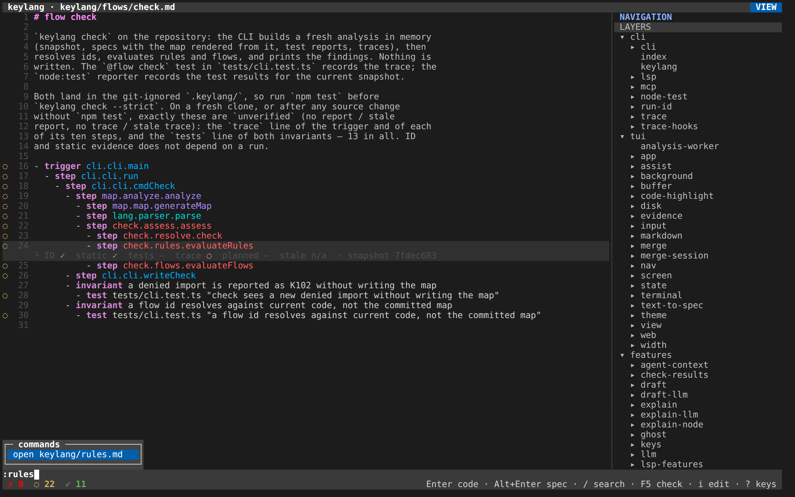
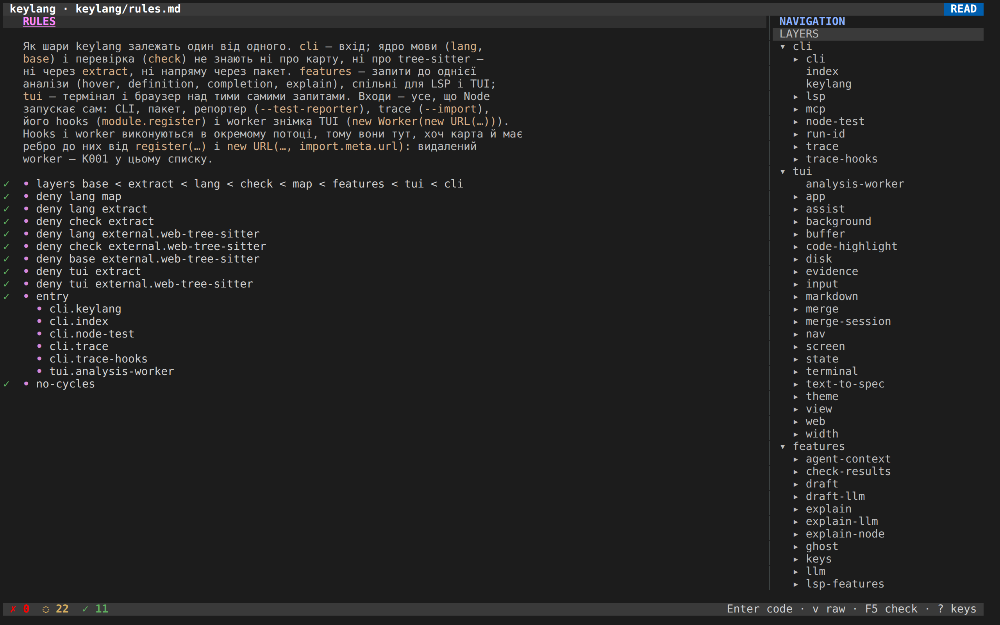
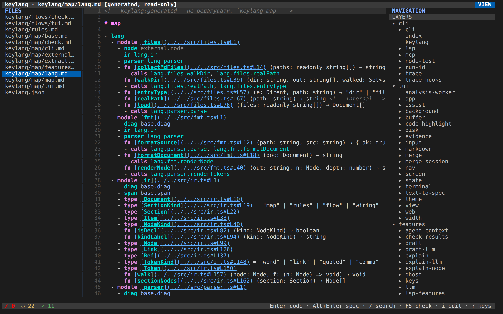
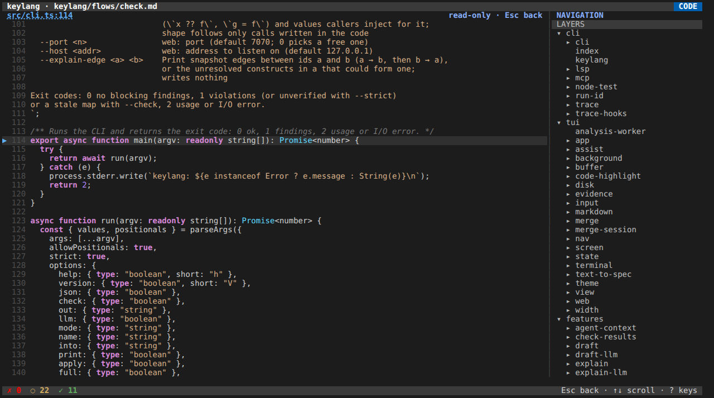

# 7. Wiring, інтерфейс і агенти

[Курс](README.md) · [English](../07-tools.md) · **Українською**

Правила й потоки перевіряють код, який у вас уже є. Ще три поверхні сидять на тому самому аналізі: генератор wiring, інтерфейс термінала й браузера, інструменти агента. Жодна не вигадує другий вердикт.

## Wiring

`# wiring` перелічує фабрики. `keylang wire` генерує `keylang.gen.ts`, типізовану `async function wire(env)`, яка будує кожну фабрику раз, залежності першими. Контейнера в runtime і пошуку за рядком немає. Контракт — [ADR 0003](../../adr/0003-wiring-lifecycle.md).

```markdown
# wiring

- wire app.purchase.createPurchase
  - store domain.store.Store
- wire domain.store.Store
  - db infra.db.createDb
    - when env.DB = memory → infra.memory-db.createMemoryDb
    - compose infra.logged.logged
```

`wire <id>` — функція, яку викликають з об'єктом іменованих залежностей, або клас, який конструюють із цим об'єктом. Дитина `<аліас> <id>` — одна залежність. ID без власного `wire` — лист, його конструюють без аргументів. `when env.NAME = value → <id>` обирає іншу реалізацію, коли змінна має саме це значення; перемагає перший збіг, а рядок залежності — запасний варіант. `compose <id>` обгортає значення функцією одного аргумента. Кілька рядків `compose` застосовуються в порядку запису, перший найближчий до значення.

`check` трактує секцію як будь-яку іншу специфікацію. Невідомий ID — K001. Повторний ID `wire` або дві залежності з одним ім'ям під одним `wire` — K002. Цикл між фабриками — K301 і називає шлях. K302 — ціль, яку згенерований файл не може імпортувати чи викликати: модуль, шар або тип як фабрика; функція Python чи Rust (генератор пише TypeScript); метод екземпляра; ім'я, якого модуль не експортує. Статичний метод дозволений. Згенерований файл викликає його на імпортованому класі (`Pool.open(deps)`), як фабрику або як `compose`. `deny` між фабрикою і залежністю — K102.

`keylang wire` пише `keylang.gen.ts` з маркером `// keylang:generated`. Файл без маркера він не перезапише (код 1). Будь-яка діагностика секції — і нічого не пишеться. `--check` порівнює і нічого не пише. `--out` приймає відносний шлях `.ts`, `.mts` або `.cts` всередині репозиторію. Згенерований модуль — звичайний модуль у тому шарі, куди падає його шлях, тож ті самі правила `deny` діють і на нього. `tsc` проєкту перевіряє його типи. keylang — ні.

Wiring не ізолює модулі. Написані вручну імпорти повністю обходять `wire()`. Такі імпорти ловлять правила. Генерація Rust, ліниві залежності й час життя на запит є в дизайні і відсутні в інструменті.

## Термінал і браузер

`keylang` без команди відкриває інтерфейс, коли stdin і stdout — TTY, інакше друкує usage з кодом 2. `keylang web` віддає той самий інтерфейс на `http://127.0.0.1:7070/#t=<token>` (порт і хост — прапорці). Токен у фрагменті URL, який браузер серверу не надсилає; сторінка переносить його в `sessionStorage` і віддає як підпротокол WebSocket. Типово сервер слухає localhost. Інший `--host` захищений лише токеном; для віддаленої машини надійніший SSH-тунель до localhost.

Екран — це специфікація як Markdown, жолоб, рядок стану і дерево навігації. `?` відкриває список клавіш поточного режиму:


Клавіші перегляду, потрібні в перший день:

| Клавіша | Дія |
|---|---|
| `↑` `↓` або `j` `k`, `PgUp` `PgDn`, `g` `G` | Рух |
| `Enter` або Ctrl+клік | Відкрити код ID під курсором |
| `Alt+Enter` | Відкрити оголошення в специфікації (для ID коду — згенеровану карту) |
| `K` або наведення мишею | Hover |
| `Tab` | Редактор, потім навігація, потім список файлів |
| `F2` / `F3` | Показати або сховати список файлів і дерево навігації |
| `F5` | Проаналізувати знову |
| `v` | Режим читання: заголовки й наголос відрендерені, жолоб і далі прив'язаний до рядків джерела |
| `i` | Редагування. Згенеровані карти відмовляють і кажуть змінити код або правила |
| `/`, потім `n` | Пошук у поточному буфері |
| `:` | Палітра команд, нечіткий пошук. `open keylang/rules.md` стрибає у файл |
| `e` | Показати збережене пояснення ID, якщо ви запускали `explain --llm`. CLI друкує `fresh` або `stale` |
| `s` | Знайти вузол за ID або за словами коментаря документації чи збереженого brief-а |
| `t` | На файлі шару перемкнути карту і карту з поясненнями. Коли її вимкнено, рядок стану каже, як увімкнути `explain.map` |
| `F4` | Панель контексту агента: що пішло б у чернетку, з грубою оцінкою токенів |
| `m` | Злити пропозицію цього файла по шматках |
| `q` або `Ctrl+C` | Вихід. З незбереженими правками перше натискання питає, друге відкидає |

`:` і `rules` фільтрують палітру до файла правил. Знімок спіймав це до Enter:



`v` рендерить Markdown. Маркери лишаються перевірюваними. `Enter` на ID все ще стрибає:



`F2` — список файлів. Ручні специфікації йдуть першими, потім згенеровані файли карти, потім `keylang.json`, який відкривається в тому самому редакторі як простий текст. Збереження годує наступний аналіз:



`Enter` на ID відкриває вбудований переглядач коду лише для читання, коли `$EDITOR` не задано, і завжди в `keylang web`. У терміналі натомість береться `$VISUAL` або `$EDITOR` (`code` і `cursor` отримують `-g file:line` і не забирають екран). `Esc` повертає:



Редагування (`i`) — буфер специфікації. `Ctrl+S` записує його. `Ctrl+Space` доповнює ключові слова й ID для позиції. K001 від невідомого ID з'являється після аналізу overlay, ще до збереження. `Ctrl+Z` скасовує правку. `Ctrl+G` перетворює виділену прозу або абзац під курсором на рядки `step`, `when` / `then`, `invariant` або `emits` і відкриває їх як злиття. Модель він не викликає. Він упізнає лише ID, які вже є у знімку, плюс кілька англійських і українських слів-підказок (`when`, `if`, `коли`, `якщо`, `invariant`, `emits`).

Знімок будує worker. Поки він працює, рядок стану каже, що результати на екрані застарілі, а клавіші працюють. Правки — overlay до `Ctrl+S`. На шляху аналізу нічого не пишеться.

`keylang lsp` говорить ті самі діагностики й вердикти через stdio. Символи workspace знаходять вузол за іменем, за ID і за словами коментаря документації чи збереженого brief-а. Клієнт в `editors/vscode/` — тонка обгортка. У Marketplace він не опублікований і в npm-архів не входить.

## Агенти

keylang агента не запускає. `init` і `keylang agents` пишуть керований блок в `AGENTS.md`. Де вони бачать Claude, Codex, Cursor або opencode, реєструють ще сервер MCP `keylang` і копіюють skill `keylang-feature`. Код пише агент своїми інструментами. Вердикт і далі дає `check`. Які каталоги рахуються харнесом — в [уроці 2](02-install-and-check.md). `--agents=none` цих файлів не пише і все одно пише baseline.

Файл фічі — звичайна специфікація. `keylang feature <slug>` і інструмент MCP `feature_status` готові, коли кожен `planned` у `keylang/features/<slug>.md` реалізовано, кожен крок його потоків має static `ok` і не лишилось жодного `fail` правил, включно з baseline. Тести й trace звітуються і цю відповідь не блокують.

Claude і Codex ставлять ще хук Stop. `keylang hook stop` читає подію зі stdin і виконує змінену перевірку: знахідки, що зачіпають файли, змінені від `HEAD`, включно з невідстеженими і з видаленим файлом, чиї ID ще називає потік. Новий `fail` відповідає `decision: block` і `file:line`. Та сама подія з `stop_hook_active: true` або запуск без нового `fail` відповідає `{}`. Хук нічого не пише. Обидві відповіді — JSON і код виходу 0. Cursor користується хуками Claude. opencode хука Stop не отримує. Звичайний `check` git не читає.

Рукописні правила змінюються лише пропозицією. `apply_diff` зберігає повний новий текст однієї специфікації і лишає файл, доки ви не зіллєте. Згенерований файл він не приймає. Після зміни графа `keylang baseline` переписує `rules.baseline.md`. Нове ребро через baseline — K102, доки не з'явиться `allow` у `rules.md` або ця перегенерація. Claude і Codex не мають Edit і Write для обох файлів правил.

Решта чернеток лишається пропозиціями.

| Команда | Яку пропозицію пише | Чого не зробить |
|---|---|---|
| `draft flow <trigger>` | Потік у `.keylang/proposals/<spec>/flows/` | Специфікацію не редагує. `--mode algo` детермінований за розв'язаними викликами, глибина 4. `llm` і `hybrid` питають модель і потім звіряють. `hybrid` без моделі падає в `algo` |
| `draft rules` | Правила, які поточний код уже виконує, або правила моделі з мітками `agree`, `conflict`, `llm-only` | Не послаблює вже написаний `deny`, доки ви не зіллєте той шматок |
| `draft map` | Нічого. Друкує розкладку `keylang.json` | Розкладка змінюється, лише коли ви редагуєте файл |
| `code-to-spec <файл:рядок>` | Потоки для функції на цьому рядку або для кожної експортованої функції | `--since <git-ref>` обмежує чернетку функціями, яких торкається diff |
| `spec-to-code <id>` | Заготовку і падаючі тести для `planned fn` | `--apply` пише файли напряму. Типово — ні |
| `explain <id> --llm` | `keylang/explain/<id>.md` | Ніколи не змінює вердикт. `explain --stale` перелічує пояснення, чий код зрушив |

`keylang mcp` віддає через stdio search (ID або слова коментаря документації чи brief-а), node, code, flows, check, explain, `context` (той самий пакет, що `F4`, для одного ID або всіх ID файла фічі), `validate_spec` (діагностики тексту специфікації, без запису), `scaffold` (шаблон `spec-to-code`, без моделі й без запису), `feature_status` і `apply_diff`. Пише лише `apply_diff`, і лише пропозицію. Він відхиляє шляхи поза каталогом специфікацій, згенеровані файли і все, що містить `..`. Файл на диску не змінюється, доки людина не зіллє.

В інтерфейсі `m` відкриває diff поточного файла проти пропозиції. `a` приймає шматок, `r` відхиляє, `u` скасовує останнє рішення, `n` рухається, `w` записує прийняті шматки, `Esc` скасовує і лишає пропозицію. Шматок, щодо якого ви не вирішили, не застосовується. `u` з режиму перегляду відкочує останнє злиття, лише поки файл містить рівно цей результат.

`Ctrl+Space` у перегляді, на потоці з тригером, просить у моделі чернетку цього потоку і відкриває злиття. Потрібен `agent` у `keylang.json`. Чернетка — не доказ: після злиття `check` оцінює нові кроки як будь-які інші. Рядок, який вигадала модель і якого знімок не підтримує, стає `unverified` або `fail`, не `ok`.

Ghost-текст у редакторі — один запропонований рядок у кінці свіжого маркера `- `. `Tab` вставляє його, `Esc` прибирає. Голос (`Ctrl+R` під час редагування) опційний, локальний або хмарний. `keylang doctor` каже, який рушій налаштовано. Ні ghost-текст, ні голос самі файл не пишуть.

Корисна звичка та сама, на якій закінчується урок про правила. Нехай інструмент і модель пропонують. Прочитайте шматок. Прийміть ті, що кажуть те, що ви мали на увазі. Запустіть `check` і вірте вердикту, а не коментарю, що рядок написала модель.

Далі: [сесії](08-use-cases.md). Чотири зі знімками. Остання — текстом.
