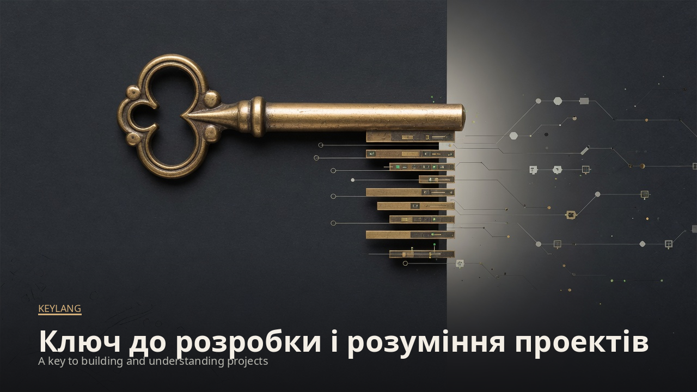

# Курс keylang

[English](../README.md) · **Українською**

Посібник з читання й написання keylang і з CLI, термінального інтерфейсу та браузера. Нормативна граматика лишається в [`docs/format.md`](../../format.md). Якщо курс і той файл розходяться щодо діагностики чи прапорця, перемагає специфікація. [`docs/design.md`](../../design.md) — цільовий дизайн; він описує речі, яких інструмент ще не робить, і курс це позначає.

Знімки знято з цього репозиторію командою `node bin/keylang.js web` 2026-09-28 і з `node bin/keylang.js check` на `examples/shop`. Локальні trace і звіт тестів були застарілі, тому такі докази показані як `unverified`.

| Урок | Ви зможете |
|---|---|
| [1. Що таке keylang](01-what-it-is.md) | Сказати, які задачі інструмент бере, які залишає і чого він коштує |
| [2. Встановлення, check, explain](02-install-and-check.md) | Запустити CLI, прочитати код виходу і відрізнити порушення від браку доказів |
| [3. Мова](03-the-language.md) | Написати карту, правила і потік, які розбираються |
| [4. Карта](04-map.md) | Налаштувати шари і прочитати згенеровану карту разом із її дірками |
| [5. Правила](05-rules.md) | Записати порядок шарів, deny, entry, exports і цикли та прочитати K101–K105 |
| [6. Потоки](06-flows.md) | Докласти докази `ID`, `static`, `tests` і `trace` і прочитати жолоб |
| [7. Wiring, інтерфейс і агенти](07-tools.md) | Згенерувати `wire()`, керувати TUI і лишити вивід агента пропозицією |
| [8. Сценарії](08-use-cases.md) | Пройти чотири сесії зі знімками |

Починайте з уроку 1, якщо вирішуєте, чи користуватися. З уроку 2 — якщо репозиторій уже є і потрібен перший `check`.
